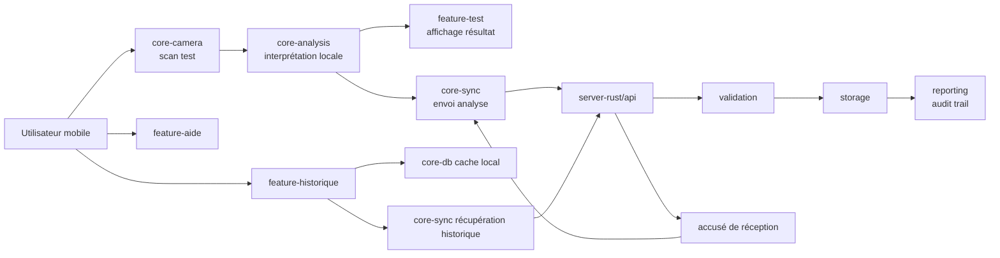

# Architecture cible minimale

## Vue d'ensemble

Le système est composé de :
- une application Android (`android-app`) pour le scan et la consultation,
- un serveur Rust (`server-rust`) pour l'API, la validation et l'audit,
- une couche de synchronisation mobile ↔ serveur.

## Schéma de flux

## Flux couverts

1. **Scan mobile** : capture via `core-camera` puis orchestration depuis `feature-test`.
2. **Analyse** : traitement initial via `core-analysis`.
3. **Synchro** : transmission des analyses et récupération historique via `core-sync`.
4. **Audit trail** : persisté côté serveur (`storage`) et journalisé via `reporting`.
